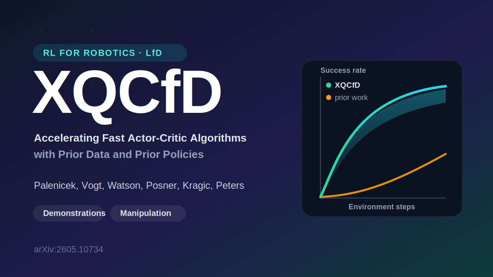

👋 Hi, I’m Daniel. I'm a PhD student in reinforcement learning for robotics at TU Darmstadt 🤖

## 📚 Publications

<table>
  <tr>
    <td width="320">
      
    </td>
    <td valign="top">
      <b>XQCfD: Accelerating Fast Actor-Critic Algorithms with Prior Data and Prior Policies</b> 
      Daniel Palenicek, Florian Vogt, Joe Watson, Ingmar Posner, Danica Kragic, Jan Peters 
      <i>arXiv preprint, 2026</i> 
      📄 <a href="https://arxiv.org/abs/2605.10734">arXiv:2605.10734</a>
    </td>
  </tr>
</table>
